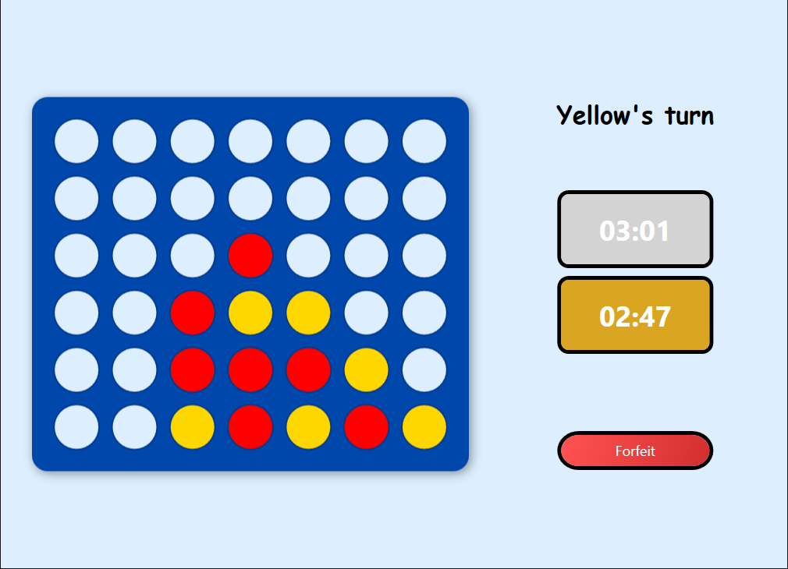

# Connect4



## Description

Connect4 is a laboratory project for a .NET class, implemented as a WPF desktop application using the MVVM architecture.

The game supports:
- Local game history storage using a SQLite database
- Custom player names
- Adjustable time controls

## Purpose

The purpose of this project is to learn .NET development using WPF and the MVVM pattern.

## Technologies

- **Visual Studio 2022**
- **.NET 8.0**
- **WPF**
- **MVVM architecture**
- **Entity Framework Core (SQLite)**

## NuGet Packages
The project uses the following packages:
```
Microsoft.EntityFrameworkCore.Sqlite (8.0.6)
Microsoft.EntityFrameworkCore.Tools  (8.0.6)
```
